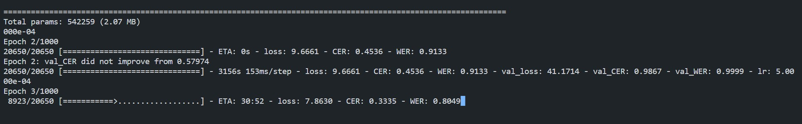

# Team3: EduAIgorithms

This is the repo for working on our AI in education project for the Next-gen Hackathon.

## Project Description

### Convolutional Neural Network (CNN)

Our project is about using AI to help teachers evaluate essays and give feedback to students. We are using the [Kaggle Handwriting Recognition Dataset](https://www.kaggle.com/datasets/landlord/handwriting-recognition) to train our model.

The model is yet to be trained completely, 3 iterations out of 1000 have been done so far for time constraint, and the results are noticed (See screenshot below). We are still working on it.


The model is a CNN model, and the code is in the `model.py` file. 

### Web App

Based on Vue.js, we are building a web app that will allow teachers to upload essays and get feedback on them. The web app will also allow students to upload their essays and get feedback on them.

### Connecting the CNN to the Web App

Based on Flask, we are building an API that will allow the web app to communicate with the CNN model. The API will eventually be in the `api.py` file.

## How to run the code

To run the code, you need to have Python 3 installed on your machine. You also need to install the packages in the `requirements.txt` file. To do so, run the following command:

```bash
pip install -r requirements.txt
```

Then, you can run the code using the following command:

```bash
python model.py
```

## How to use the model

The model is not yet trained completely, so it is not ready to be used. However, once it is trained, you will be able to use it by running the following command:

```bash
python predict.py <path_to_image>
```

The `<path_to_image>` is the path to the image you want to predict. The image should be a PNG image with a white background and black text. The image should also be 28x28 pixels.

